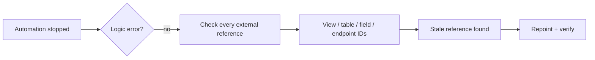

# Workflow Automation — client case studies

`SANITIZED CLIENT CASE STUDIES`

**Project type:** Sanitized client case studies
**Evidence sources:** completed Upwork contracts (5.0), completed Fiverr orders and reviews, historical account audit
**Status:** delivered

Umbrella repository for automation engagements that are real but individually
small — the workflow builds, the integrations, and the "it worked last week and
it doesn't now" jobs.

---

## Engagements

### n8n workflow build — Upwork

A workflow designed and built to the client's requirements and delivered ahead of
schedule. Contract closed at **5.0**. The client's public review:

> "Delivered a clean, efficient solution ahead of schedule."
> — Upwork client, November 2025

**Tools.** n8n · APIs · webhooks

### Google Contacts backup automation — Upwork

Scheduled backup workflow in n8n.
→ Full write-up: **[n8n-google-contacts-backup](https://github.com/skmalikllc/n8n-google-contacts-backup)**

### Contact sync between two platforms — Upwork

iCloud ↔ Google Contacts reconciliation.
→ Full write-up: **[icloud-google-contacts-sync](https://github.com/skmalikllc/icloud-google-contacts-sync)**

### Make.com + Airtable automation failure — troubleshooting

An automation that had stopped firing. The scenario itself was fine; the fault was
a **stale Airtable View ID** — the view the scenario pointed at had been replaced,
so the trigger was watching something that no longer existed.

This is the shape most "broken automation" jobs take. Nothing is wrong with the
logic. Something it refers to moved, and the platform's error message does not say
so. The fix is tracing the reference, not rebuilding the workflow.

**Tools.** Make.com · Airtable

### n8n / Make automation builds — Fiverr

Automation orders delivered through Fiverr under a single service line, with
client reviews recorded against it in the account history.

`AUDITED 26 SEPTEMBER 2026`

| | |
|---|---|
| Completed orders in this service line | **6** |
| Of those, carrying a buyer rating | **2** |
| Ratings observed | all 5 stars |
| Largest single engagement observed | $345 |
| Reviewed window | February 2025 – September 2026 |

Counted from the 103 of 221 completed orders individually reviewed before the
platform presented a human-verification step and the audit stopped. Further
orders in this line may exist among the remaining 118; they are not estimated.

**Architecture is not described for these six.** The audit recorded the service
line, date, value and rating — not the node chains. Rather than reconstruct a
workflow diagram from a service title, they are counted and left at that.

**Tools.** n8n · Make.com

---

## The diagnostic that comes up most

Nothing is wrong with the workflow. Something it *refers to* moved, and the
platform's error message does not say so.

## Implementation notes

Workflow exports, scenario blueprints, node chains, API keys and webhook URLs are
intentionally omitted — those belong to the clients whose accounts they run in.
Where a detail is not documented, it is left out rather than reconstructed.

## Privacy

No client names, no credentials, no webhook secrets, no workflow exports.

## Related

- [contact-dedupe-mcp](https://github.com/skmalikllc/contact-dedupe-mcp) — open-source tool, the data-cleaning half of this work
- [fiverr-project-archive](https://github.com/skmalikllc/fiverr-project-archive) — full engagement accounting
- [automation-portfolio](https://github.com/skmalikllc/automation-portfolio)
